# Quick Start Guide - Cold Case Analysis System

This guide provides a quick overview of how to get started with the Cold Case Analysis system.

## System Overview

The Cold Case Analysis system provides three different interfaces for analyzing court decisions:

```mermaid
graph TB
    User[Legal Analyst/Researcher]
    
    subgraph "Analysis Interfaces"
        CLI[🖥️ CLI Application<br/>Batch Processing]
        Web[🌐 Web Application<br/>Interactive Analysis]
        API[⚙️ LangGraph Engine<br/>Advanced Workflows]
    end
    
    subgraph "Use Cases"
        Batch[Bulk Analysis<br/>Multiple Cases]
        Interactive[Single Case<br/>Step-by-step Review]
        Advanced[Custom Workflows<br/>Human-in-the-loop]
    end
    
    User --> CLI
    User --> Web
    User --> API
    
    CLI --> Batch
    Web --> Interactive
    API --> Advanced

    classDef interface fill:#e3f2fd,stroke:#1976d2,stroke-width:2px
    classDef usecase fill:#f3e5f5,stroke:#7b1fa2,stroke-width:2px
    
    class CLI,Web,API interface
    class Batch,Interactive,Advanced usecase
```



## Quick Setup

### Prerequisites
- Python 3.12.3
- OpenAI API Key (recommended) or Llama API Key

### 1. Environment Setup
```bash
# Clone and enter repository
cd cold-case-analysis

# Create environment file
cp blueprint.env .env

# Edit .env and add your API key
# OPENAI_API_KEY=your_key_here

# Install dependencies
pip install -r requirements.txt
```

### 2. Choose Your Interface

#### 🖥️ CLI Application (Batch Processing)
**Best for**: Processing multiple court cases, evaluation against ground truth

```bash
# Run CLI analyzer
python cold_case_analyzer/main.py

# Follow interactive prompts:
# 1. Select data source (Own data/Airtable)
# 2. Choose model (gpt-4o/gpt-4o-mini/llama3.1)
# 3. Wait for analysis completion
# 4. Optional: Run evaluation
```

**Requirements**: 
- `cases.xlsx` in `cold_case_analyzer/data/` folder
- `concepts.xlsx` for legal theme classification

#### 🌐 Web Application (Interactive Analysis)
**Best for**: Single case analysis, step-by-step review, user feedback

```bash
# Install additional dependencies
cd cold_case_analyzer_agent/streamlit
pip install pymupdf4llm psycopg2-binary

# Start web application
streamlit run app.py --server.port=8501 --server.address=0.0.0.0

# Open browser: http://localhost:8501
```

**Features**:
- Demo case available (BGE 132 III 285)
- PDF upload support
- Interactive feedback at each step
- Optional database persistence

#### ⚙️ LangGraph Engine (Advanced Workflows)
**Best for**: Custom workflows, experimental features, developer integration

```bash
# Run LangGraph analyzer
cd cold_case_analyzer/cca_langgraph
python main.py
```

**Features**:
- Graph-based workflow orchestration
- Human-in-the-loop validation points
- Customizable analysis pipeline

## Analysis Workflow

All interfaces follow this general analysis pattern:

```mermaid
flowchart LR
    Input[📄 Court Decision] --> Jurisdiction[🏛️ Detect Jurisdiction]
    Jurisdiction --> COL[📝 Extract COL Section]
    COL --> Theme[🏷️ Classify Theme]
    Theme --> Analysis[🔍 Complete Analysis]
    Analysis --> Output[📊 Structured Results]
    
    subgraph "Analysis Components"
        Abstract[Abstract]
        Facts[Relevant Facts]
        Provisions[PIL Provisions]
        Issue[COL Issue]
        Position[Court Position]
    end
    
    Analysis --> Abstract
    Analysis --> Facts
    Analysis --> Provisions
    Analysis --> Issue
    Analysis --> Position

    classDef process fill:#e3f2fd,stroke:#1976d2
    classDef component fill:#f3e5f5,stroke:#7b1fa2
    
    class Input,Jurisdiction,COL,Theme,Analysis,Output process
    class Abstract,Facts,Provisions,Issue,Position component
```



## Sample Input/Output

### Input: Court Decision Text
```
Federal Court, 20.12.2005 - BGE 132 III 285
...Swiss Federal Supreme Court decision regarding FIFA rules and choice of law...
```

### Output: Structured Analysis
```json
{
  "Abstract": "Article 116 of the Swiss Private International Law Act (PILA); admissibility of choice of law...",
  "Relevant Facts": "The case involves X. AG, a company based in St. Gallen, Switzerland...",
  "PIL Provisions": ["Art. 116 PILA", "Art. 129 CO"],
  "Theme": ["Non-State law (rules of law)"],
  "Choice of Law Issue": "Can parties choose non-state rules, such as those established by private organizations...",
  "Court Position": "The court's position on the choice of law issue under Article 116..."
}
```

## Validation & Testing

### Basic Validation
```bash
# Test Python environment
python --version  # Should show Python 3.12.3

# Test imports
python -c "import streamlit; print('✓ Streamlit works')"

# Test CLI module (with proper path)
cd cold_case_analyzer
PYTHONPATH=/path/to/cold_case_analyzer python -c "from main import main; print('✓ CLI works')"
```

### Demo Case Testing
1. **Web Interface**: Click "Use Demo Case" to load BGE 132 III 285
2. **CLI Interface**: Ensure `cases.xlsx` contains demo data
3. **LangGraph**: Uses built-in sample case in `main.py`

## Troubleshooting

### Common Issues

1. **Module Import Errors**
   ```bash
   # Set PYTHONPATH for CLI
   export PYTHONPATH=/path/to/cold_case_analyzer
   ```

2. **Missing API Key**
   ```bash
   # Check .env file
   cat .env | grep OPENAI_API_KEY
   ```

3. **Streamlit Won't Start**
   ```bash
   # Install missing dependencies
   pip install pymupdf4llm psycopg2-binary
   ```

4. **Long Processing Times**
   - CLI analysis: Several minutes per case (normal)
   - LLM calls: 30+ seconds per component (normal)
   - Never cancel long-running operations

## Next Steps

- **Read Full Documentation**: [Architecture & Data Flow](ARCHITECTURE.md)
- **Understand Workflows**: [Workflows & Processes](WORKFLOWS.md)
- **Explore Agent Implementation**: [Agent Workflow](agent.md)
- **Review Ground Truth**: See `cold_case_analyzer/data/ground_truth.csv`
- **Customize Prompts**: Edit files in `prompts/` directories

## Support

For issues and questions:
- Check the comprehensive documentation in the `docs/` folder
- Review existing issues in the GitHub repository
- Consult the [CoLD project website](https://cold.global/) for research context