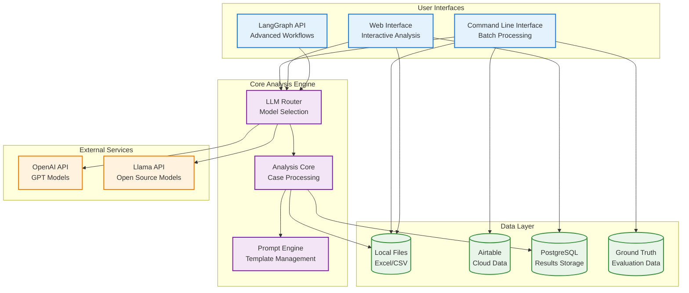
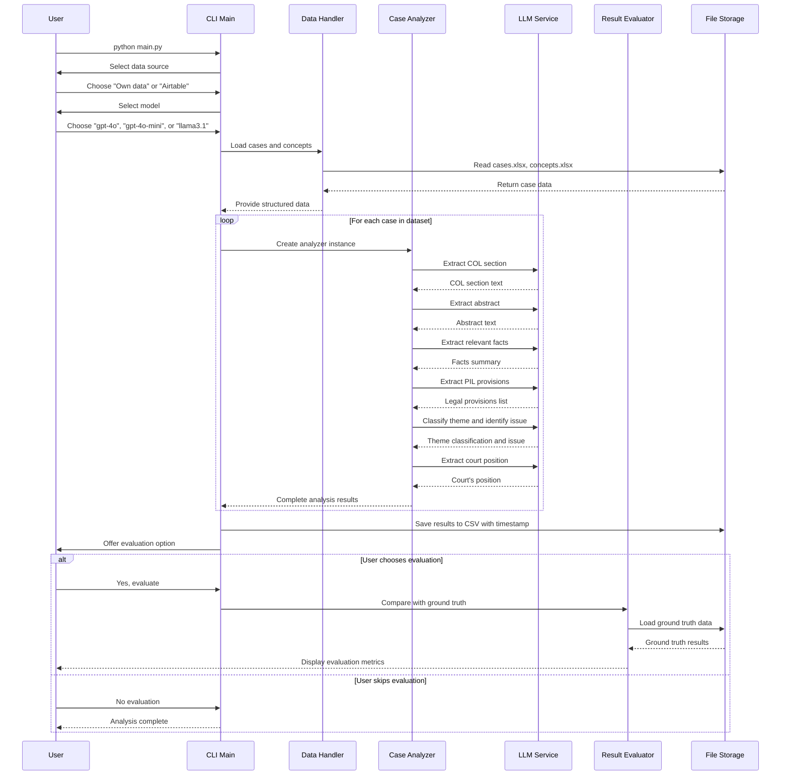
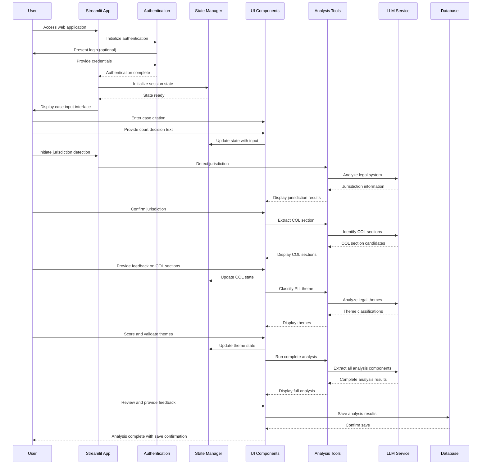
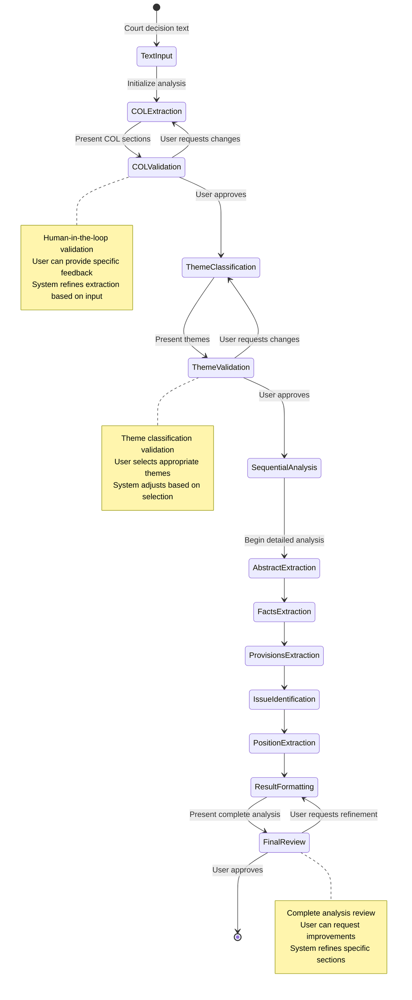
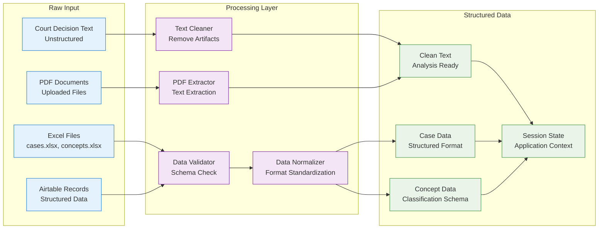
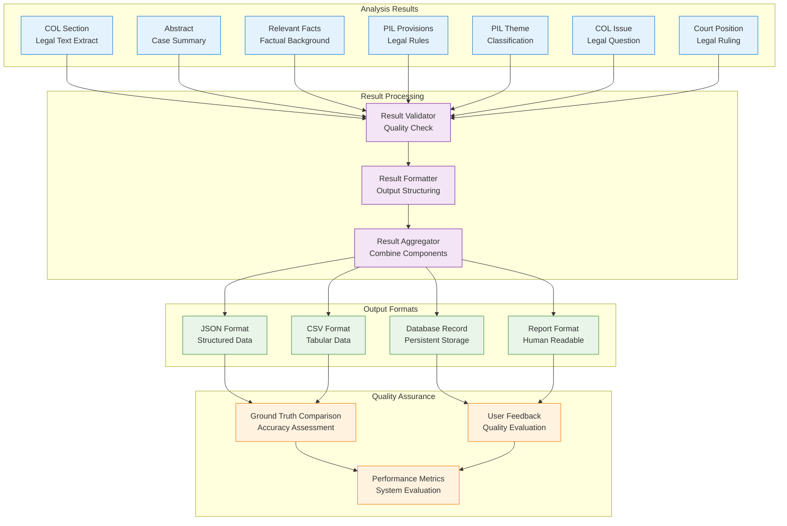

# Cold Case Analysis - System Workflow Documentation

This document provides detailed workflow diagrams and data flow patterns for the Cold Case Analysis system.

## High-Level System Interaction



## Complete Analysis Workflow

This diagram shows the end-to-end analysis process from input to final results:

```mermaid
flowchart TD
    Start([User Initiates Analysis])
    
    subgraph "Input Phase"
        DataSource{Select Data Source}
        LocalInput[Load Local Cases<br/>cases.xlsx]
        AirtableInput[Fetch Airtable Data<br/>Remote Cases]
        ManualInput[Manual Text Input<br/>Single Case]
        ModelSelect[Select LLM Model<br/>GPT-4o/Mini/Llama]
    end
    
    subgraph "Pre-Processing"
        ValidateInput[Validate Input Data<br/>Required Fields Check]
        JurisdictionDetect[Detect Jurisdiction<br/>Legal System Identification]
        PrepareContext[Prepare Analysis Context<br/>Load Concepts & Prompts]
    end
    
    subgraph "Core Analysis Loop"
        ExtractCOL[Extract Choice of Law Section<br/>Key Legal Text Identification]
        ValidateCOL{User Validates COL Section}
        ClassifyTheme[Classify PIL Theme<br/>Legal Topic Classification]
        ValidateTheme{User Validates Theme}
        
        subgraph "Detailed Analysis"
            ExtractAbstract[Extract Abstract<br/>Case Summary]
            ExtractFacts[Extract Relevant Facts<br/>Factual Background]
            ExtractProvisions[Extract PIL Provisions<br/>Legal Rules]
            IdentifyIssue[Identify COL Issue<br/>Legal Question]
            ExtractPosition[Extract Court Position<br/>Legal Ruling]
        end
    end
    
    subgraph "Post-Processing"
        CompileResults[Compile Analysis Results<br/>Structured Output]
        FormatOutput[Format Final Output<br/>User-Friendly Display]
        ValidateResults{User Validates Results}
        SaveResults[Save Results<br/>Database/File Storage]
        GenerateReport[Generate Analysis Report<br/>Summary & Insights]
    end
    
    subgraph "Evaluation & Feedback"
        CompareGroundTruth[Compare with Ground Truth<br/>Quality Assessment]
        CollectFeedback[Collect User Feedback<br/>Improvement Data]
        UpdateModel[Update Model Performance<br/>Learning Integration]
    end
    
    End([Analysis Complete])
    
    %% Flow connections
    Start --> DataSource
    DataSource --> LocalInput
    DataSource --> AirtableInput
    DataSource --> ManualInput
    
    LocalInput --> ModelSelect
    AirtableInput --> ModelSelect
    ManualInput --> ModelSelect
    
    ModelSelect --> ValidateInput
    ValidateInput --> JurisdictionDetect
    JurisdictionDetect --> PrepareContext
    PrepareContext --> ExtractCOL
    
    ExtractCOL --> ValidateCOL
    ValidateCOL -->|Approved| ClassifyTheme
    ValidateCOL -->|Rejected| ExtractCOL
    
    ClassifyTheme --> ValidateTheme
    ValidateTheme -->|Approved| ExtractAbstract
    ValidateTheme -->|Rejected| ClassifyTheme
    
    ExtractAbstract --> ExtractFacts
    ExtractFacts --> ExtractProvisions
    ExtractProvisions --> IdentifyIssue
    IdentifyIssue --> ExtractPosition
    
    ExtractPosition --> CompileResults
    CompileResults --> FormatOutput
    FormatOutput --> ValidateResults
    
    ValidateResults -->|Approved| SaveResults
    ValidateResults -->|Refinement Needed| ExtractAbstract
    
    SaveResults --> GenerateReport
    GenerateReport --> CompareGroundTruth
    CompareGroundTruth --> CollectFeedback
    CollectFeedback --> UpdateModel
    UpdateModel --> End

    classDef start fill:#e8f5e8,stroke:#388e3c,stroke-width:3px
    classDef input fill:#e3f2fd,stroke:#1976d2,stroke-width:2px
    classDef process fill:#f3e5f5,stroke:#7b1fa2,stroke-width:2px
    classDef decision fill:#fff3e0,stroke:#f57c00,stroke-width:2px
    classDef output fill:#fce4ec,stroke:#880e4f,stroke-width:2px
    classDef end fill:#e8f5e8,stroke:#388e3c,stroke-width:3px

    class Start,End start
    class DataSource,LocalInput,AirtableInput,ManualInput,ModelSelect input
    class ValidateInput,JurisdictionDetect,PrepareContext,ExtractCOL,ClassifyTheme,ExtractAbstract,ExtractFacts,ExtractProvisions,IdentifyIssue,ExtractPosition,CompileResults,FormatOutput process
    class ValidateCOL,ValidateTheme,ValidateResults decision
    class SaveResults,GenerateReport,CompareGroundTruth,CollectFeedback,UpdateModel output
```

## Application-Specific Workflows

### CLI Application Workflow



### Streamlit Application Workflow



### LangGraph Engine Workflow



## Data Processing Patterns

### Input Data Transformation



### Result Generation Pipeline



This workflow documentation provides detailed insights into how the Cold Case Analysis system processes data and manages user interactions across all three application interfaces.